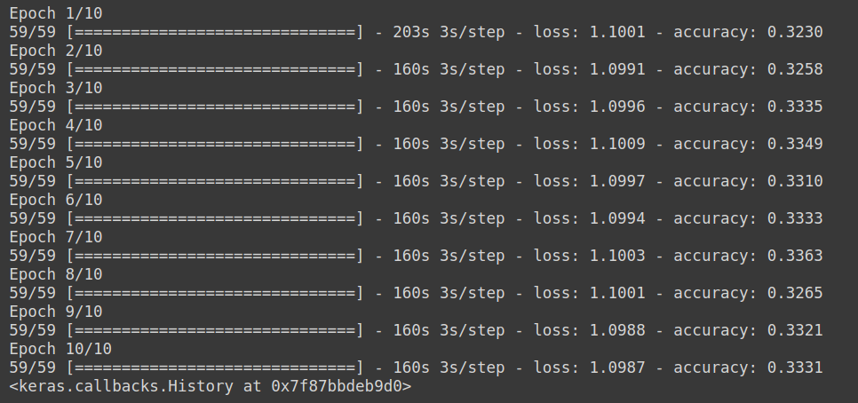
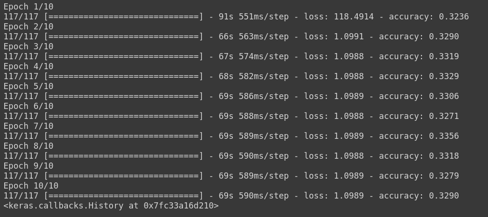
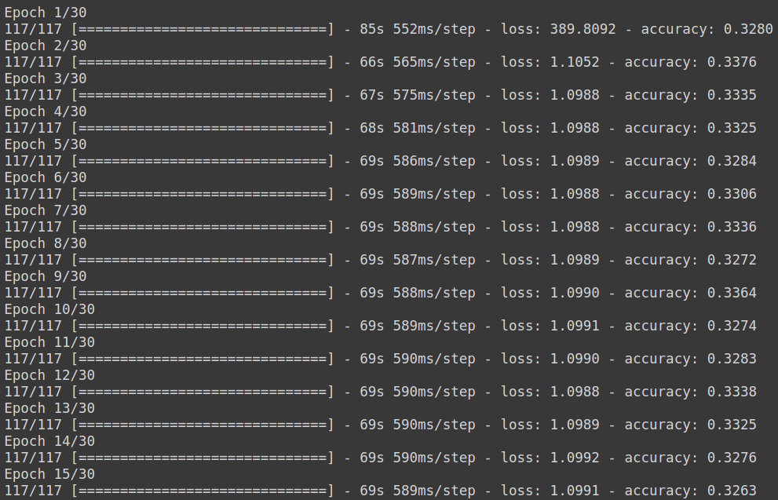
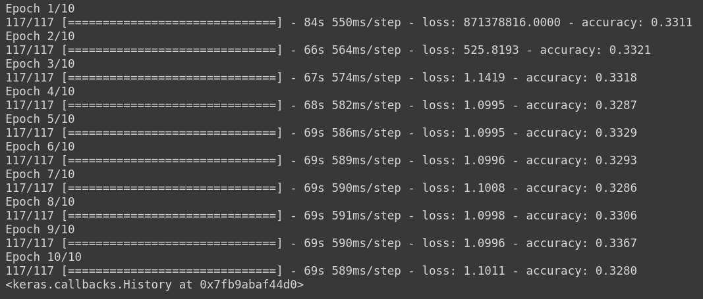
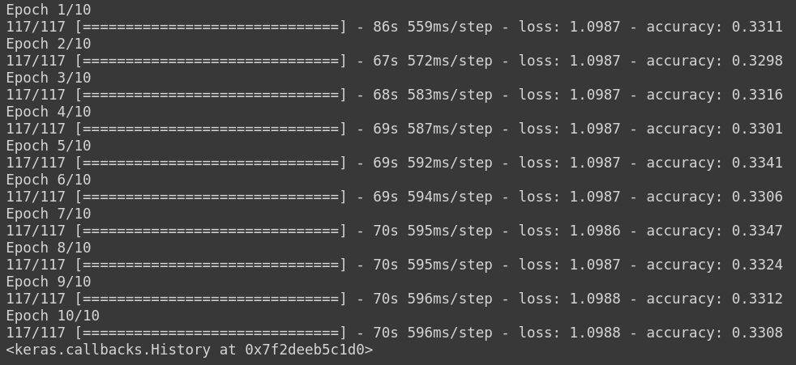

# 1D-CNN Multi-Class Model 1
>## Classes :
```
    1. Noise 
    2. BBH signal + Noise
    3. BNS signal + Noise
```

>## Dataset :
```
| S.No. | Data Type          | Mode of generation   | No. of Samples |
| ----- | ------------------ | -------------------- | -------------- |
| 1     | Noise              | Gaussian             | 5000           |
| 2     | BBH signal + Noise | SEOBNRv2             | 5000           |
| 3     | BNS signal + Noise | IMRPhenomPv2_NRTidal | 5000           |
```

>## Trial Hyperparameters :
```
| Trial No. | Normalized? | Val split(in %) | Dropout rate | Optimizer | lr    | Batch Size | Epochs |
| --------- | ----------- | --------------- | ------------ | --------- | ----- | ---------- | ------ |
| 1         | No          | 0               | 0.2          | Adam      | 1e-3  | 256        | 10     |
| 2         | No          | 0               | 0.2          | Adam      | 1e-2  | 128        | 10     |
| 3         | No          | 0               | 0.2          | Adam      | 1e-2  | 128        | 15     |
| 4         | No          | 0               | 0.2          | Adam      | 1e-1  | 128        | 10     |
| 5         | No          | 0               | 0.2          | Adam      | 1e-4  | 128        | 10     |
```

>## Trial Results :
>### Trial 1:
<p align="center">  </p>

>### Trial 2:
<p align="center">  </p>

>### Trial 3:
<p align="center">  </p>

>### Trial 4:
<p align="center">  </p>

>### Trial 5:
<p align="center">  </p>

>### Trial 6:
<p align="center">  </p>

>## Conclusions :

+ ### <p> Batch size = 128 is ideal since it has a faster runtime than batch size = 256 and it also does not cause the runtime  to crash due to exhaustion of RAM resources on colab. </p>
+ ### <p> 10 epochs are enough to determine whether the model is able to learn any features. </p>
+ ### <p> lr = 1e-4 hardly causes any change in the loss and accuracy at all so there is no point in reducing the learning rate further. </p>

