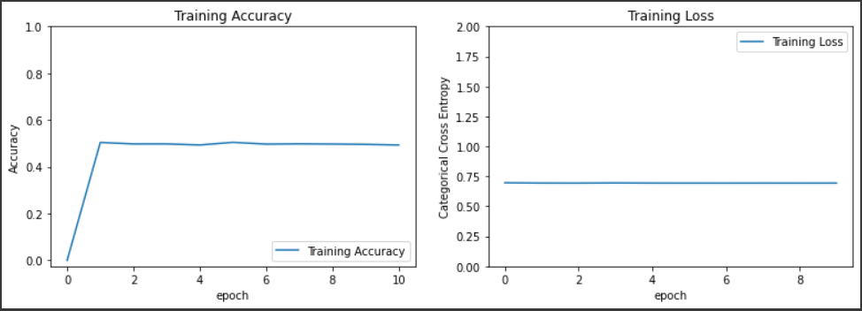
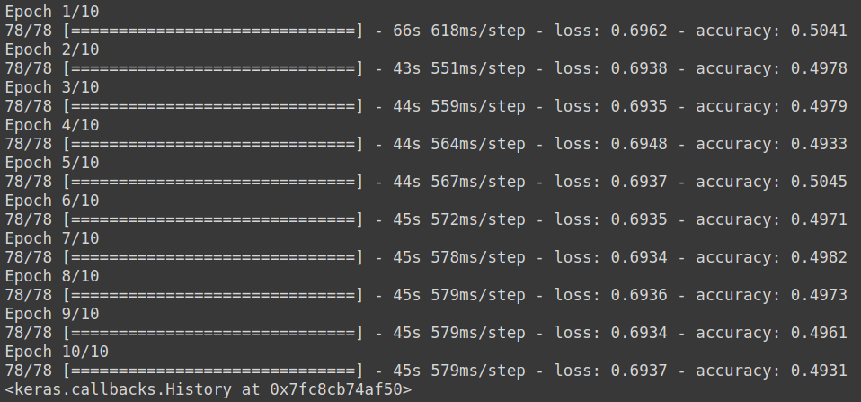
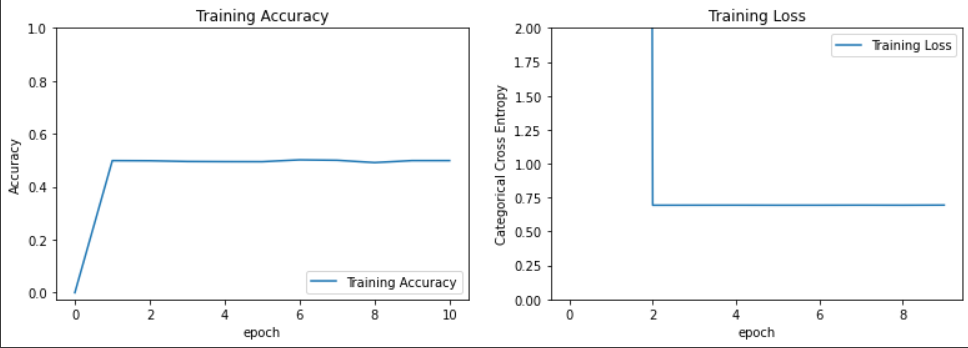
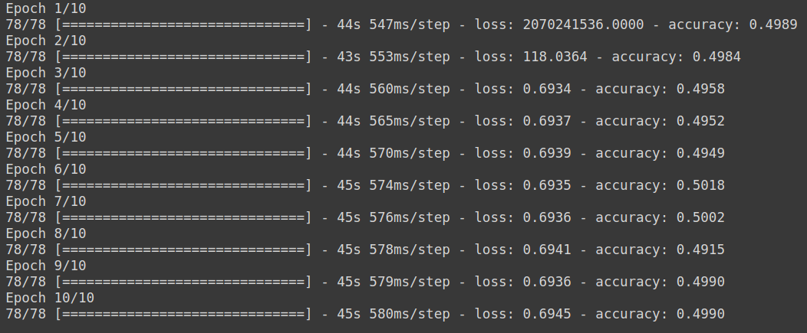
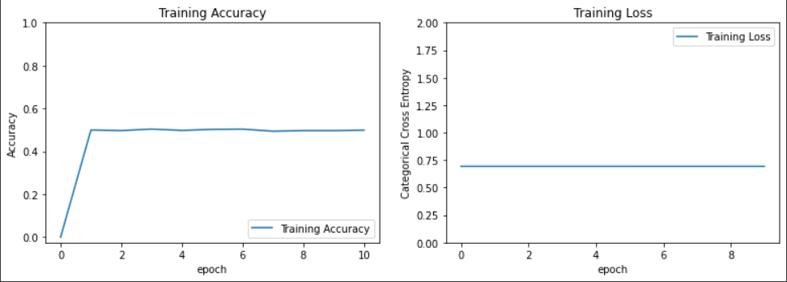
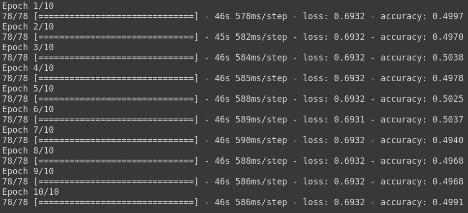
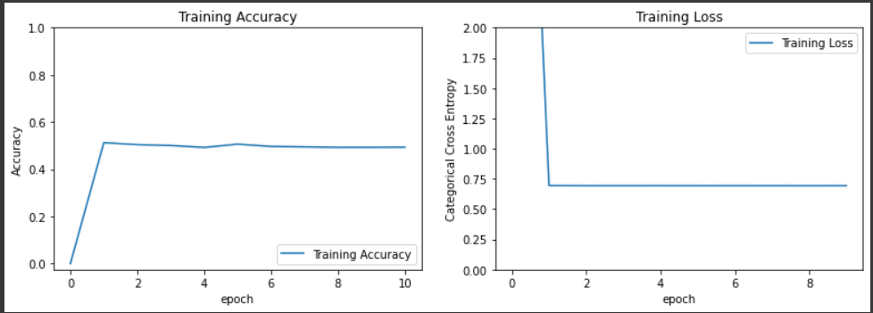
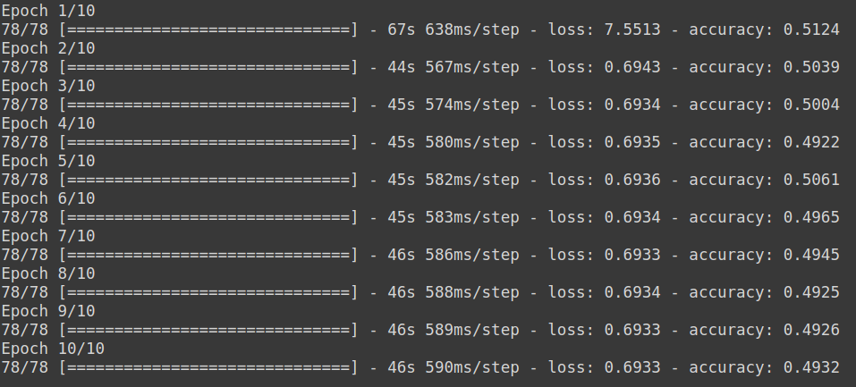
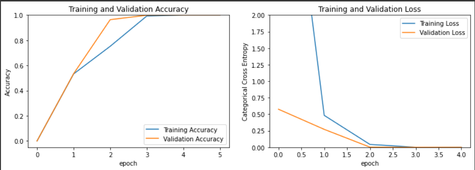
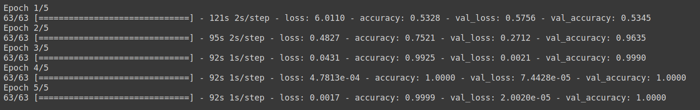

# Model Architecture :
The following model has been obtained from the paper authored by Yash Chauhan [1]. You can read this paper [here](/Literature%20Review/Classification/1D-CNN/yash_chauhan.pdf).
```
Model: "sequential"
_________________________________________________________________
Layer (type)                 Output Shape              Param #   
=================================================================
conv1d (Conv1D)              (None, 16353, 64)         2112      
_________________________________________________________________
max_pooling1d (MaxPooling1D) (None, 4088, 64)          0         
_________________________________________________________________
re_lu (ReLU)                 (None, 4088, 64)          0         
_________________________________________________________________
conv1d_1 (Conv1D)            (None, 4025, 128)         524416    
_________________________________________________________________
max_pooling1d_1 (MaxPooling1 (None, 1006, 128)         0         
_________________________________________________________________
re_lu_1 (ReLU)               (None, 1006, 128)         0         
_________________________________________________________________
conv1d_2 (Conv1D)            (None, 943, 256)          2097408   
_________________________________________________________________
max_pooling1d_2 (MaxPooling1 (None, 235, 256)          0         
_________________________________________________________________
re_lu_2 (ReLU)               (None, 235, 256)          0         
_________________________________________________________________
conv1d_3 (Conv1D)            (None, 108, 512)          16777728  
_________________________________________________________________
max_pooling1d_3 (MaxPooling1 (None, 27, 512)           0         
_________________________________________________________________
re_lu_3 (ReLU)               (None, 27, 512)           0         
_________________________________________________________________
flatten (Flatten)            (None, 13824)             0         
_________________________________________________________________
dense (Dense)                (None, 13824)             191116800 
_________________________________________________________________
dense_1 (Dense)              (None, 128)               1769600   
_________________________________________________________________
dense_2 (Dense)              (None, 64)                8256      
_________________________________________________________________
dropout (Dropout)            (None, 64)                0         
_________________________________________________________________
dense_3 (Dense)              (None, 2)                 130       
=================================================================
Total params: 212,296,450
Trainable params: 212,296,450
Non-trainable params: 0
_________________________________________________________________
```

# Classes :
```
1. Noise 
2. BBH signal + Noise
```

# Dataset :
```
| S.No. | Data Type          | Mode of generation   | No. of Samples |
| ----- | ------------------ | -------------------- | -------------- |
| 1     | Noise              | Gaussian             | 5000           |
| ----- | ------------------ | -------------------- | -------------- |
| 2     | BBH signal + Noise | SEOBNRv2             | 5000           |
```

# Trial Hyperparameters :
```
| Trial No. | Normalized? | Amplitude Re-Scaled? | Val split(in %) | Dropout rate | Optimizer | lr   | Batch Size | Epochs |
| --------- | ----------- | -------------------- | --------------- | ------------ | --------- | ---- | ---------- | ------ |
| 1         | No          | No                   | 0               | 0.2          | Adam      | 1e-3 | 128        | 10     |
| --------- | ----------- | -------------------- | --------------- | ------------ | --------- | ---- | ---------- | ------ |
| 2         | No          | No                   | 0               | 0.2          | Adam      | 1e-1 | 128        | 10     |
| --------- | ----------- | -------------------- | --------------- | ------------ | --------- | ---- | ---------- | ------ |
| 3         | No          | No                   | 0               | 0.2          | Adam      | 1e-5 | 128        | 10     |
| --------- | ----------- | -------------------- | --------------- | ------------ | --------- | ---- | ---------- | ------ |
| 4         | Yes         | Yes (Due to Norm)    | 0               | 0.2          | Adam      | 1e-3 | 128        | 10     |
| --------- | ----------- | -------------------- | --------------- | ------------ | --------- | ---- | ---------- | ------ |
| 5         | No          | Yes                  | 20              | 0.2          | Adam      | 1e-3 | 128        | 5      |
```
 
# Trial Results :
## Trial 1:
<p align="center">  </p>
<p align="center">  </p>

## Trial 2:
<p align="center">  </p>
<p align="center">  </p>

## Trial 3:
<p align="center">  </p>
<p align="center">  </p>

## Trial 4:
<p align="center">  </p>
<p align="center">  </p>

## Trial 5:
<p align="center">  </p>
<p align="center">  </p>

# Conclusions :

+ Batch size = 128 is ideal since it has a faster runtime than batch size = 256 and it also does not cause the runtime  to crash due to exhaustion of RAM resources on colab. 
+ 10 epochs are enough to determine whether the model is able to learn any features. 
+ lr = 1e-5 hardly causes any change in the loss and accuracy at all so there is no point in reducing the learning rate further. 
+ Normalization of the dataset caused the training time to increase significantly, and the results were still baseline, so it is not feasible to try out further combinations with normalization. 

# References :
1. Chauhan, Y., 2020. Deep Learning Techniques to Make Gravitational Wave Detections from Weak Time-series Data. arXiv preprint arXiv:2007.05889.


