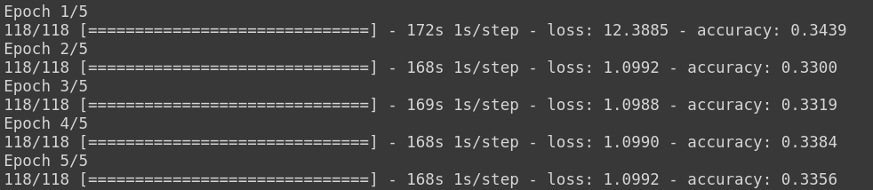

# Model Architecture :
The following model has been obtained from the paper authored by Yash Chauhan [1]. You can read this paper [here](/Literature%20Review/Classification/1D-CNN/yash_chauhan.pdf).
```
Model: "sequential"
_________________________________________________________________
Layer (type)                 Output Shape              Param #   
=================================================================
conv1d (Conv1D)              (None, 16353, 64)         2112      
_________________________________________________________________
max_pooling1d (MaxPooling1D) (None, 4088, 64)          0         
_________________________________________________________________
re_lu (ReLU)                 (None, 4088, 64)          0         
_________________________________________________________________
conv1d_1 (Conv1D)            (None, 4025, 128)         524416    
_________________________________________________________________
max_pooling1d_1 (MaxPooling1 (None, 1006, 128)         0         
_________________________________________________________________
re_lu_1 (ReLU)               (None, 1006, 128)         0         
_________________________________________________________________
conv1d_2 (Conv1D)            (None, 943, 256)          2097408   
_________________________________________________________________
max_pooling1d_2 (MaxPooling1 (None, 235, 256)          0         
_________________________________________________________________
re_lu_2 (ReLU)               (None, 235, 256)          0         
_________________________________________________________________
conv1d_3 (Conv1D)            (None, 108, 512)          16777728  
_________________________________________________________________
max_pooling1d_3 (MaxPooling1 (None, 27, 512)           0         
_________________________________________________________________
re_lu_3 (ReLU)               (None, 27, 512)           0         
_________________________________________________________________
flatten (Flatten)            (None, 13824)             0         
_________________________________________________________________
dense (Dense)                (None, 128)               1769600   
_________________________________________________________________
dense_1 (Dense)              (None, 64)                8256      
_________________________________________________________________
dropout (Dropout)            (None, 64)                0         
_________________________________________________________________
dense_2 (Dense)              (None, 2)                 130       
=================================================================
Total params: 21,179,650
Trainable params: 21,179,650
Non-trainable params: 0
_________________________________________________________________
```

# Classes :
```
1. Noise 
2. BBH signal + Noise
3. BNS signal + Noise
```

# Dataset :
To generate this dataset, use the "IMPORTS" section (code cell no. 1), the "BBH Data Generation" section (code cell no. 2-6) and the "BNS Data Generation" section (code cell no. 7-11) of the [Data Generation](/scripts/Data%20Generation.ipynb) script.
```
| S.No. | Data Type          | Mode of generation   | No. of Samples |
| ----- | ------------------ | -------------------- | -------------- |
| 1     | Noise              | Gaussian             | 5000           |
| ----- | ------------------ | -------------------- | -------------- |
| 2     | BBH signal + Noise | SEOBNRv2             | 5000           |
| ----- | ------------------ | -------------------- | -------------- |
| 3     | BNS signal + Noise | IMRPhenomPv2_NRTidal | 5000           |
| ----- | ------------------ | -------------------- | -------------- |
```

# Trial Hyperparameters :
```
| Trial No. | Accuracy | Normalized? | Amplitude Re-Scaled?    | Dropout | Optimizer | lr   | Batch Size | Epochs |
| --------- | -------- | ----------- | ----------------------- | ------- | --------- | ---- | ---------- | ------ |
| 1         | 33.56%   | No          | Yes                     | 0.2     | Adam      | 1e-3 | 128        | 10     |
|           |          |             | (Noise       - by 1e19) |         |           |      |            |        |
|           |          |             | (BBH + Noise - by 1e19) |         |           |      |            |        |
|           |          |             | (BNS + Noise - by 1e20) |         |           |      |            |        |
| --------- | -------- | ----------- | ----------------------- | ------- | --------- | ---- | ---------- | ------ |
```

# Trial Results :
## Trial 1:
<p align="center">  </p>
<p align="center">  </p> 

# References :
1. Chauhan, Y., 2020. Deep Learning Techniques to Make Gravitational Wave Detections from Weak Time-series Data. arXiv preprint arXiv:2007.05889.


