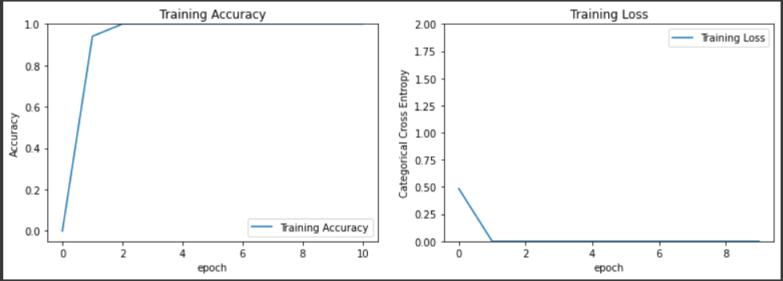

# Model Architecture :
The following model has been obtained from the paper authored by Plamen G. Krastev [1]. You can read this paper [here](/Literature%20Review/Classification/1D-CNN/krastev_1.pdf).
``` 
Model: "sequential"
_________________________________________________________________
Layer (type)                 Output Shape              Param #   
=================================================================
conv1d (Conv1D)              (None, 16369, 16)         272       
_________________________________________________________________
max_pooling1d (MaxPooling1D) (None, 4092, 16)          0         
_________________________________________________________________
re_lu (ReLU)                 (None, 4092, 16)          0         
_________________________________________________________________
conv1d_1 (Conv1D)            (None, 4085, 32)          4128      
_________________________________________________________________
max_pooling1d_1 (MaxPooling1 (None, 1021, 32)          0         
_________________________________________________________________
re_lu_1 (ReLU)               (None, 1021, 32)          0         
_________________________________________________________________
conv1d_2 (Conv1D)            (None, 1014, 64)          16448     
_________________________________________________________________
max_pooling1d_2 (MaxPooling1 (None, 253, 64)           0         
_________________________________________________________________
re_lu_2 (ReLU)               (None, 253, 64)           0         
_________________________________________________________________
conv1d_3 (Conv1D)            (None, 246, 128)          65664     
_________________________________________________________________
max_pooling1d_3 (MaxPooling1 (None, 61, 128)           0         
_________________________________________________________________
re_lu_3 (ReLU)               (None, 61, 128)           0         
_________________________________________________________________
flatten (Flatten)            (None, 7808)              0         
_________________________________________________________________
dense (Dense)                (None, 7808)              60972672  
_________________________________________________________________
dense_1 (Dense)              (None, 64)                499776    
_________________________________________________________________
dense_2 (Dense)              (None, 3)                 195       
=================================================================
Total params: 61,559,155
Trainable params: 61,559,155
Non-trainable params: 0
_________________________________________________________________
```

# Classes :
```
1. Noise 
2. BBH signal + Noise
3. BNS signal + Noise
```

# Dataset :
```
| S.No. | Data Type          | Mode of generation   | No. of Samples |
| ----- | ------------------ | -------------------- | -------------- |
| 1     | Noise              | Gaussian             | 5000           |
| ----- | ------------------ | -------------------- | -------------- |
| 2     | BBH signal + Noise | SEOBNRv2             | 5000           |
| ----- | ------------------ | -------------------- | -------------- |
| 3     | BNS signal + Noise | IMRPhenomPv2_NRTidal | 5000           |
```

# Trial Hyperparameters :
```
| Trial No. | Normalized? | Amplitude Re-Scaled? | Val split(in %) | Optimizer | lr   | Batch Size | Epochs |
| --------- | ----------- | -------------------- | --------------- | --------- | ---- | ---------- | ------ |
| 1         | No          | No                   | 0               | Adam      | 1e-3 | 128        | 10     |
| --------- | ----------- | -------------------- | --------------- | --------- | ---- | ---------- | ------ |
| 2         | No          | No                   | 0               | Adam      | 1e-1 | 128        | 10     |
| --------- | ----------- | -------------------- | --------------- | --------- | ---- | ---------- | ------ |
| 3         | No          | No                   | 0               | Adam      | 1e-5 | 128        | 10     |
| --------- | ----------- | -------------------- | --------------- | --------- | ---- | ---------- | ------ |
| 4         | No          | No                   | 0               | Adam      | 1e-3 | 128        | 100    |
| --------- | ----------- | -------------------- | --------------- | --------- | ---- | ---------- | ------ |
| 5         | No          | No                   | 0               | Adam      | 1e-1 | 128        | 100    |
| --------- | ----------- | -------------------- | --------------- | --------- | ---- | ---------- | ------ |
| 6         | Yes         | Yes (Due to Norm)    | 0               | Adam      | 1e-5 | 128        | 100    |
| --------- | ----------- | -------------------- | --------------- | --------- | ---- | ---------- | ------ |
| 7         | No          | Yes                  | 20              | Adam      | 1e-3 | 128        | 5      |
| --------- | ----------- | -------------------- | --------------- | --------- | ---- | ---------- | ------ |
```

# Trial Results :
## Trial 1:
<p align="center">  </p>
<p align="center">  </p>


## Trial 2:
<p align="center">  </p>
<p align="center">  </p>


## Trial 3:
<p align="center">  </p>
<p align="center">  </p>


## Trial 4:
<p align="center">  </p>
<p align="center">  </p>


## Trial 5:
<p align="center">  </p>
<p align="center">  </p>


## Trial 6:
<p align="center">  </p>
<p align="center">  </p>

## Trial 7:
<p align="center">  </p>
<p align="center">  </p>


# Conclusions :

+ This model is much smaller and faster than the one used [previously](/models/1D-CNN%20Multi-class/Model%201/), hence it was feasible to train this model on a large no. of epochs.
+ Normalization of the dataset caused the runtime on colab to crash due to insufficient RAM, and the results were still baseline, so it is not possible to try out further combinations with normalization.

# References :
1. Krastev, Plamen. (2019). Real-Time Detection of Gravitational Waves from Binary Neutron Stars using Artificial Neural Networks.


