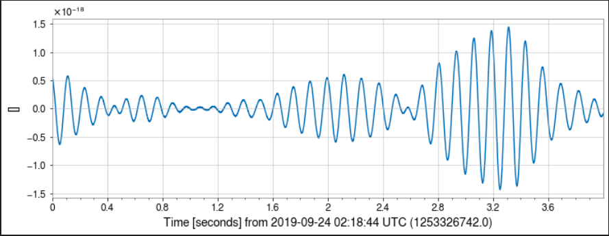
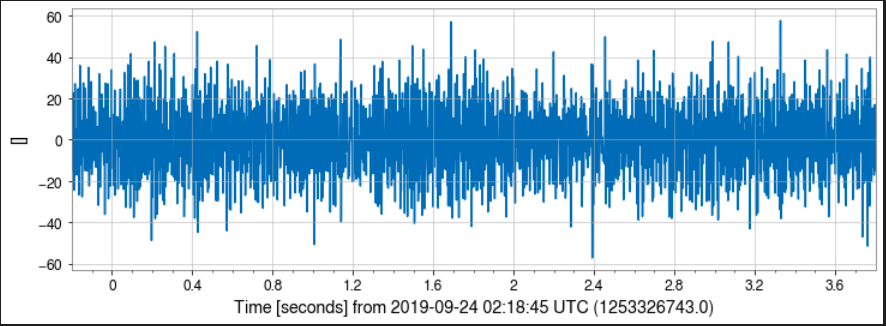

The classes involved in the Binary Classification task being performed here are as follows:
```
1. Noise 
2. BBH signal + Noise
```
Note that the class BBH signal + Noise represents the strain data that is obtained from the detector.

# Test Dataset Description:
In [this](/models/Testing_on_real_strain_data/1D-CNN%20Binary%20Classification) section, the models were tested on real BBH strain data obtained from the LIGO Detector.

```
| S.No. | Data Type            | Downloaded From | No. of Samples |
| ----- | -------------------- | --------------- | -------------- |
| 1     | BBH Strain Data i.e. | GWOSC           | 48             |
|       | (BBH signal + Noise) |                 |                |
| ----- | -------------------- | --------------- | -------------- |
```

The test dataset consists of 48 strain data samples of `32 sec` duration and `4 kHz` frequency. Each data sample has been obtained from the following list of BBH mergers.

```
|                          List of BBH Mergers                          |
| --------------- | --------------- | --------------- | --------------- |
| GW150914        | GW190413_052954 | GW190521_074359 | GW190728_064510 |
| --------------- | --------------- | --------------- | --------------- |
| GW151012        | GW190413_134308 | GW190527_092055 | GW190731_140936 |
| --------------- | --------------- | --------------- | --------------- |
| GW151226        | GW190421_213856 | GW190602_175927 | GW190803_022701 |
| --------------- | --------------- | --------------- | --------------- |
| GW170104        | GW190424_180648 | GW190620_030421 | GW190814        |
| --------------- | --------------- | --------------- | --------------- |
| GW170608        | GW190425        | GW190630_185205 | GW190828_063405 |
| --------------- | --------------- | --------------- | --------------- |
| GW170729        | GW190503_185404 | GW190701_203306 | GW190828_065509 |
| --------------- | --------------- | --------------- | --------------- |
| GW170809        | GW190512_180714 | GW190706_222641 | GW190909_114149 |
| --------------- | --------------- | --------------- | --------------- |
| GW170814        | GW190513_205428 | GW190707_093326 | GW190910_112807 |
| --------------- | --------------- | --------------- | --------------- |
| GW170818        | GW190514_065416 | GW190708_232457 | GW190915_235702 |
| --------------- | --------------- | --------------- | --------------- |
| GW170823        | GW190517_055101 | GW190719_215514 | GW190924_021846 |
| --------------- | --------------- | --------------- | --------------- |
| GW190408_181802 | GW190519_153544 | GW190720_000836 | GW190929_012149 |
| --------------- | --------------- | --------------- | --------------- |
| GW190412        | GW190521        | GW190727_060333 | GW190930_133541 |
| --------------- | --------------- | --------------- | --------------- |
```

This compiled list of BBH mergers has been obtained from the paper by `Sobrinho, José & Azevedo Freitas, Sara. (2021)` [1]. You can find the paper [here](/Literature%20Review/Datasets/list%20of%20bbh%20mergers.pdf). 

# Test Dataset Download and Pre-Processing:
To download this dataset, use the `IMPORTS` section (code cell no. 1), the `BBH Merger Strain Data Download` section (code cell no. 2-5) of the [GWOSC_data_download](/scripts/GWOSC_data_download.ipynb) script.

Every data sample is of `32 sec` duration and `4 kHz` frequency. A `4 sec` interval around the BBH merger of one of the samples is shown below. This is the original, un-processed data strain.

<p align="center">  </p>

## Data Processing Pipeline:
The following processing techniques are used on the strain data sample to convert it into a form that can be input to the model for testing. The Original data sample is of `32 sec` duration and `4 kHz` frequency. 
The Order in which they are performed on the sample is given in the 1st column.

```
| Order | Processing Technique | Code                              |
| ----- | -------------------- | --------------------------------- |
| 1     | Whitening            | data.whiten(4, 4)                 |
| ----- | -------------------- | --------------------------------- |
| 2     | Highpass Filtering   | data.highpass_fir(30, 512)        |
| ----- | -------------------- | --------------------------------- |
| 3     | Lowpass Filtering    | data.lowpass_fir(250, 512)        |
| ----- | -------------------- | --------------------------------- |
| 4     | Time Slicing         | data.time_slice(gps - 2, gps + 2) |
| ----- | -------------------- | --------------------------------- |
```

The resultant, processed strain data sample of `4 sec` duration and `4 kHz` frequency is shown below.

<p align="center">  </p>

# References :
1. Sobrinho, José & Azevedo Freitas, Sara. (2021). A list of 48 Binary Black Hole mergers. 10.13140/RG.2.2.11329.07526. 


