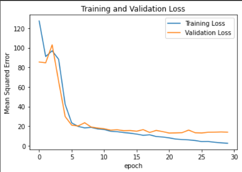
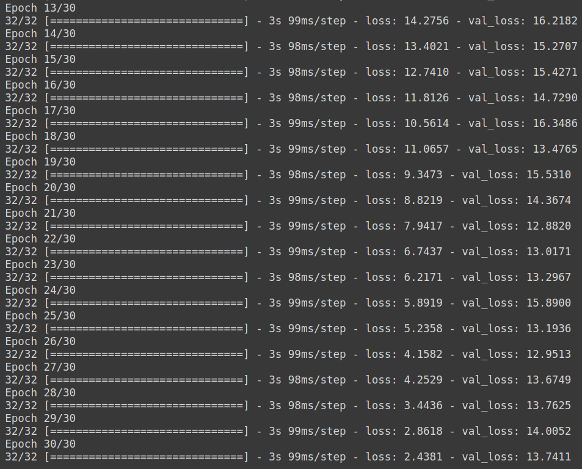

Note that here we are training the model to estimate the parameters m1 and m2 which are the component masses of the Binary black holes corresponding to the BBH merger.

# Parameters :
```
1. m1 
2. m2
```

# Dataset :
It is ensured that the signal is well hidden in the merged BBH signal + Noise.
```
| S.No. | Data Type          | Mode                   | No. of Samples | Noise Label                        | Signal Label             |
| ----- | ------------------ | ---------------------- | -------------- | ---------------------------------- | ------------------------ |
| 1     | Noise              | Gaussian (scale = 0.1) | 5000           | N1, N2, N3, .... , N5000           | Not Applicable           |
|       |                    | (amplitude is scaled   |                |                                    |                          |
|       |                    | to 1e-18)              |                |                                    |                          |
| ----- | ------------------ | ---------------------- | -------------- | ---------------------------------- | ------------------------ |
| 2     | BBH signal + Noise | SEOBNRv2               | 5000           | N5001, N5002, N5003, .... , N10000 | S1, S2, S3, .... , S5000 |
| ----- | ------------------ | ---------------------- | -------------- | ---------------------------------- | ------------------------ |
```

# Model Architecture :
The following model has been obtained from the paper authored by Plamen G. Krastev [1]. You can read this paper [here](/Literature%20Review/Classification/1D-CNN/krastev_1.pdf).
``` 
Model: "sequential_1"
_________________________________________________________________
Layer (type)                 Output Shape              Param #   
=================================================================
conv1d_4 (Conv1D)            (None, 16369, 16)         272       
_________________________________________________________________
max_pooling1d_4 (MaxPooling1 (None, 4092, 16)          0         
_________________________________________________________________
re_lu_4 (ReLU)               (None, 4092, 16)          0         
_________________________________________________________________
conv1d_5 (Conv1D)            (None, 4085, 32)          4128      
_________________________________________________________________
max_pooling1d_5 (MaxPooling1 (None, 1021, 32)          0         
_________________________________________________________________
re_lu_5 (ReLU)               (None, 1021, 32)          0         
_________________________________________________________________
conv1d_6 (Conv1D)            (None, 1014, 64)          16448     
_________________________________________________________________
max_pooling1d_6 (MaxPooling1 (None, 253, 64)           0         
_________________________________________________________________
re_lu_6 (ReLU)               (None, 253, 64)           0         
_________________________________________________________________
conv1d_7 (Conv1D)            (None, 246, 128)          65664     
_________________________________________________________________
max_pooling1d_7 (MaxPooling1 (None, 61, 128)           0         
_________________________________________________________________
re_lu_7 (ReLU)               (None, 61, 128)           0         
_________________________________________________________________
flatten_1 (Flatten)          (None, 7808)              0         
_________________________________________________________________
dense_3 (Dense)              (None, 64)                499776    
_________________________________________________________________
dense_4 (Dense)              (None, 2)                 130       
=================================================================
Total params: 586,418
Trainable params: 586,418
Non-trainable params: 0
_________________________________________________________________
```

# Trial Hyperparameters :
The last column represents the number of folds in the cross-validation performed.
```
| Trial No. | Amplitude Re-Scaled? | Optimizer | lr   | Batch Size | Epochs | No. of folds |
| --------- | -------------------- | --------- | ---- | ---------- | ------ | ------------ |
| 1         | Yes (By 1e19)        | Adam      | 1e-3 | 128        | 30     | -            |
| --------- | -------------------- | --------- | ---- | ---------- | ------ | ------------ |
```
<!-- ```
| 2         | Yes (By 1e19)        | Adam      | 1e-3 | 128        | 5      | 2            |
| --------- | -------------------- | --------- | ---- | ---------- | ------ | ------------ |
| 3         | Yes (By 1e19)        | Adam      | 1e-3 | 128        | 5      | 3            |
| --------- | -------------------- | --------- | ---- | ---------- | ------ | ------------ |
| 4         | Yes (By 1e19)        | Adam      | 1e-3 | 128        | 5      | 4            |
| --------- | -------------------- | --------- | ---- | ---------- | ------ | ------------ |
| 5         | Yes (By 1e19)        | Adam      | 1e-3 | 128        | 5      | 5            |
| --------- | -------------------- | --------- | ---- | ---------- | ------ | ------------ |
``` -->

# Trial Results :
MSE - Mean Squared Error
MAE - Mean Absolute Error

```
|           |      Train     |      Test      |       Val      |
| Trial No. | ------ | ----- | ------ | ----- | ------ | ----- |
|           | MSE    | MAE   | MSE    | MAE   | MSE    | MAE   |
| --------- | ------ | ----- | ------ | ----- | ------ | ----- |
| 1         | 2.034  | 1.124 | 13.741 | 2.817 | 13.957 | 2.921 |
| --------- | ------ | ----- | ------ | ----- | ------ | ----- |
```
<!-- ```
| 2         | 100%  |     | 1         | 1      | 1        |     |
| --------- | ----- | --- | --------- | ------ | -------- | --- |
| 3         | 100%  |     | 1         | 1      | 1        |     |
| --------- | ----- | --- | --------- | ------ | -------- | --- |
| 4         | 100%  |     | 1         | 1      | 1        |     |
| --------- | ----- | --- | --------- | ------ | -------- | --- |
| 5         | 100%  |     | 1         | 1      | 1        |     |
| --------- | ----- | --- | --------- | ------ | -------- | --- |
``` -->

<hr>

## Trial 1:

<p align="center">  </p>
<p align="center">  </p>
<hr>

<!-- ## Trial 2:
### Train Data Confusion Matrix
<p align="center">  </p>

### Test Data Confusion Matrix
<p align="center">  </p>

### Test Data ROC
<p align="center">  </p>
<p align="center">  </p>
<p align="center">  </p>
<hr>

## Trial 3:
### Train Data Confusion Matrix
<p align="center">  </p>

### Test Data Confusion Matrix
<p align="center">  </p>

### Test Data ROC
<p align="center">  </p>
<p align="center">  </p>
<p align="center">  </p>
<hr>

## Trial 4:
### Train Data Confusion Matrix
<p align="center">  </p>

### Test Data Confusion Matrix
<p align="center">  </p>

### Test Data ROC
<p align="center">  </p>
<p align="center">  </p>
<p align="center">  </p>
<hr>

## Trial 5:
### Train Data Confusion Matrix
<p align="center">  </p>

### Test Data Confusion Matrix
<p align="center">  </p>

### Test Data ROC
<p align="center">  </p>
<p align="center">  </p>
<p align="center">  </p>


<!-- # Test Results on Unseen Generated Data:
No. of BBH Signal + Noise data samples: 1000

No. of Noise data samples: 1000

```
|        |                  Level 1                 |      Level 2      |
| S. No. | -------- | --------- | ------ | -------- | ------- | ------- |
|        | Accuracy | Precision | Recall | F1 Score | MSE     | MAE     |
| ------ | -------- | --------- | ------ | -------- | ------- | ------- |
| 1      | 100%     | 1         | 1      | 1        | 500.453 | 384.373 |
| ------ | -------- | --------- | ------ | -------- | ------- | ------- |
```

## LEVEL 1:
<p align="center">  </p>
<p align="center">  </p>

<hr> -->

# Test Results on Real Data:
No. of BBH Signal + Noise data samples: 48

No. of Noise data samples: 24

```
|        |                  Level 1                 |       Level 2       |
| S. No. | -------- | --------- | ------ | -------- | -------- | -------- |
|        | Accuracy | Precision | Recall | F1 Score | MSE      | MAE      |
| ------ | -------- | --------- | ------ | -------- | -------- | -------- |
| 1      | 100%     | 1         | 1      | 1        | 2720.939 | 43.428   |
| ------ | -------- | --------- | ------ | -------- | -------- | -------- |
```

## LEVEL 1:
<p align="center">  </p>
<p align="center">  </p>

<hr>

<!-- # Results on Marginal Events Data:
## LEVEL 1

Total no. of data samples in level 1:  27

```
| ------ | ------- | -------------- | -------------- | --------------- |
| S. No. | Scaling | No. of samples | No. of samples | No. of samples  |
|        |         | predicted as   | predicted as   | sent to Level 2 |
|        |         | Signal         | Noise          | model           |
| ------ | ------- | -------------- | -------------- | --------------- |
| 1      | 1e19    | 26             | 1              | 26              |
| ------ | ------- | -------------- | -------------- | --------------- |
| 2      | 1e18    | 20             | 7              | 20              |
| ------ | ------- | -------------- | -------------- | --------------- |
``` -->

<!-- ## LEVEL 2

Total no. of data samples in level 2:  25

```
| ------ | ------- | -------------- | -------------- |
| S. No. | Scaling | No. of samples | No. of samples |
|        |         | predicted as   | predicted as   |
|        |         | BBH Signal     | BNS Signal     |
| ------ | ------- | -------------- | -------------- |
| 1      | 1e19    | 26             | 0              |
| ------ | ------- | -------------- | -------------- |
| 2      | 1e18    | 20             | 0              |
| ------ | ------- | -------------- | -------------- |
``` -->

# References :
1. Krastev, Plamen. (2021). Detection and parameter estimation of gravitational waves from binary neutron-star mergers in real LIGO data using deep learning.


