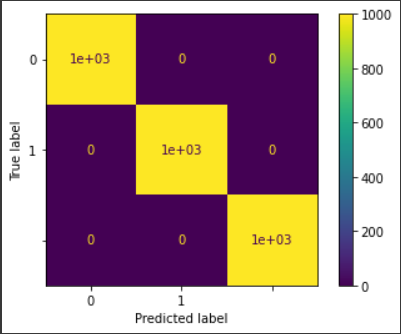

# Classes :
```
1. Noise 
2. BBH signal + Noise
3. BNS signal + Noise
```

# Dataset :
It is ensured that the signal is well hidden in the merged BBH signal + Noise. 
```
| S.No. | Data Type          | Mode of Generation     | No. of Samples | Noise Label | Signal Label             |
| ----- | ------------------ | ---------------------- | -------------- | ----------- | ------------------------ |
| 1     | Noise              | Gaussian (scale = 0.1) | 5000           | N1          | Not Applicable           |
|       |                    | (amplitude is scaled   |                |             |                          |
|       |                    | to 1e-18)              |                |             |                          |
| ----- | ------------------ | ---------------------- | -------------- | ----------- | ------------------------ |
| 2     | BBH signal + Noise | SEOBNRv2               | 5000           | N2          | S1, S2, S3, .... , S5000 |
| ----- | ------------------ | ---------------------- | -------------- | ----------- | ------------------------ |
| 3     | BNS signal + Noise | IMRPhenomPv2_NRTidal   | 5000           | N2          | S1, S2, S3, .... , S5000 |
| ----- | ------------------ | ---------------------- | -------------- | ----------- | ------------------------ |
```

# Model Architecture :
The following model has been obtained from the paper authored by Plamen G. Krastev [1]. You can read this paper [here](/Literature%20Review/Classification/1D-CNN/krastev_1.pdf).
``` 
Model: "sequential"
_________________________________________________________________
Layer (type)                 Output Shape              Param #   
=================================================================
conv1d (Conv1D)              (None, 16369, 16)         272       
_________________________________________________________________
max_pooling1d (MaxPooling1D) (None, 4092, 16)          0         
_________________________________________________________________
re_lu (ReLU)                 (None, 4092, 16)          0         
_________________________________________________________________
conv1d_1 (Conv1D)            (None, 4085, 32)          4128      
_________________________________________________________________
max_pooling1d_1 (MaxPooling1 (None, 1021, 32)          0         
_________________________________________________________________
re_lu_1 (ReLU)               (None, 1021, 32)          0         
_________________________________________________________________
conv1d_2 (Conv1D)            (None, 1014, 64)          16448     
_________________________________________________________________
max_pooling1d_2 (MaxPooling1 (None, 253, 64)           0         
_________________________________________________________________
re_lu_2 (ReLU)               (None, 253, 64)           0         
_________________________________________________________________
conv1d_3 (Conv1D)            (None, 246, 128)          65664     
_________________________________________________________________
max_pooling1d_3 (MaxPooling1 (None, 61, 128)           0         
_________________________________________________________________
re_lu_3 (ReLU)               (None, 61, 128)           0         
_________________________________________________________________
flatten (Flatten)            (None, 7808)              0         
_________________________________________________________________
dense (Dense)                (None, 7808)              60972672  
_________________________________________________________________
dense_1 (Dense)              (None, 64)                499776    
_________________________________________________________________
dense_2 (Dense)              (None, 2)                 195       
=================================================================
Total params: 61,559,155
Trainable params: 61,559,155
Non-trainable params: 0
_________________________________________________________________
```

# Trial Hyperparameters :
"5-F CV" in the last column represents 5-Fold Cross Validation. 
```
| Trial No. | Normalized? | Amplitude Re-Scaled? | Optimizer | lr   | Batch Size | Epochs | 5-F CV |
| --------- | ----------- | -------------------- | --------- | ---- | ---------- | ------ | ------ |
| 1         | No          | Yes (By 1e19)        | Adam      | 1e-3 | 128        | 5      | No     |
| --------- | ----------- | -------------------- | --------- | ---- | ---------- | ------ | ------ |
| 2         | No          | Yes (By 1e18)        | Adam      | 1e-3 | 128        | 5      | No     |
| --------- | ----------- | -------------------- | --------- | ---- | ---------- | ------ | ------ |
| 2         | No          | Yes (By 1e18)        | Adam      | 1e-3 | 128        | 5      | Yes    |
| --------- | ----------- | -------------------- | --------- | ---- | ---------- | ------ | ------ |
```

# Trial Results :
```
| Trial No. | Accuracy | Precision | Recall | F1 Score |
| --------- | -------- | --------- | ------ | -------- |
| 1         | 100%     | 1         | 1      | 1        |
| --------- | -------- | --------- | ------ | -------- |
| 2         | 100%     | 1         | 1      | 1        |
| --------- | -------- | --------- | ------ | -------- |
| 3         | 100%     | 1         | 1      | 1        |
| --------- | -------- | --------- | ------ | -------- |
```

<hr>

## Trial 1:
<p align="center">  </p>
<p align="center">  </p>
<p align="center">  </p>
<hr>

## Trial 2:
<p align="center">  </p>
<p align="center">  </p>
<p align="center">  </p>
<hr>

## Trial 3:
<p align="center">  </p>
<p align="center">  </p>
<p align="center">  </p>

# References :
1. Krastev, Plamen. (2019). Real-Time Detection of Gravitational Waves from Binary Neutron Stars using Artificial Neural Networks.


