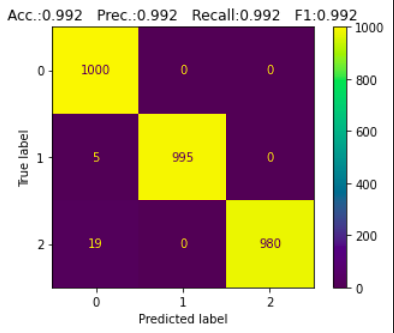

# Classes :
```
1. Noise 
2. BBH signal + Noise
3. BNS signal + Noise
```

# Dataset :
It is ensured that the signal is well hidden in the merged BBH signal + Noise.
```
| S.No. | Data Type          | Mode                   | No. of Samples | Noise Label                        | Signal Label             |
| ----- | ------------------ | ---------------------- | -------------- | ---------------------------------- | ------------------------ |
| 1     | Noise              | Gaussian (scale = 0.1) | 5000           | N1, N2, N3, .... , N5000           | Not Applicable           |
|       |                    | (amplitude is scaled   |                |                                    |                          |
|       |                    | to 1e-18)              |                |                                    |                          |
| ----- | ------------------ | ---------------------- | -------------- | ---------------------------------- | ------------------------ |
| 2     | BBH signal + Noise | SEOBNRv2               | 5000           | N5001, N5002, N5003, .... , N10000 | S1, S2, S3, .... , S5000 |
| ----- | ------------------ | ---------------------- | -------------- | ---------------------------------- | ------------------------ |
| 3     | BNS signal + Noise | IMRPhenomPv2_NRTidal   | 5000           | N5001, N5002, N5003, .... , N10000 | S1, S2, S3, .... , S5000 |
| ----- | ------------------ | ---------------------- | -------------- | ---------------------------------- | ------------------------ |
```

# Model Architecture :
The following model has been obtained from the paper authored by Plamen G. Krastev [1]. You can read this paper [here](/Literature%20Review/Classification/1D-CNN/krastev_1.pdf).
``` 
Model: "sequential_1"
_________________________________________________________________
Layer (type)                 Output Shape              Param #   
=================================================================
conv1d_4 (Conv1D)            (None, 16369, 16)         272       
_________________________________________________________________
max_pooling1d_4 (MaxPooling1 (None, 4092, 16)          0         
_________________________________________________________________
re_lu_4 (ReLU)               (None, 4092, 16)          0         
_________________________________________________________________
conv1d_5 (Conv1D)            (None, 4085, 32)          4128      
_________________________________________________________________
max_pooling1d_5 (MaxPooling1 (None, 1021, 32)          0         
_________________________________________________________________
re_lu_5 (ReLU)               (None, 1021, 32)          0         
_________________________________________________________________
conv1d_6 (Conv1D)            (None, 1014, 64)          16448     
_________________________________________________________________
max_pooling1d_6 (MaxPooling1 (None, 253, 64)           0         
_________________________________________________________________
re_lu_6 (ReLU)               (None, 253, 64)           0         
_________________________________________________________________
conv1d_7 (Conv1D)            (None, 246, 128)          65664     
_________________________________________________________________
max_pooling1d_7 (MaxPooling1 (None, 61, 128)           0         
_________________________________________________________________
re_lu_7 (ReLU)               (None, 61, 128)           0         
_________________________________________________________________
flatten_1 (Flatten)          (None, 7808)              0         
_________________________________________________________________
dense_3 (Dense)              (None, 64)                499776    
_________________________________________________________________
dense_4 (Dense)              (None, 2)                 130       
=================================================================
Total params: 586,418
Trainable params: 586,418
Non-trainable params: 0
_________________________________________________________________
```

# Trial Hyperparameters :
The last column represents the number of folds in the cross-validation performed.
```
| Trial No. | Amplitude Re-Scaled? | Optimizer | lr   | Batch Size | Epochs | No. of folds |
| --------- | -------------------- | --------- | ---- | ---------- | ------ | ------------ |
| 1         | Yes (By 1e19)        | Adam      | 1e-3 | 128        | 5      | -            |
| --------- | -------------------- | --------- | ---- | ---------- | ------ | ------------ |
```
<!-- ```
| 2         | Yes (By 1e19)        | Adam      | 1e-3 | 128        | 3      | 2            |
| --------- | -------------------- | --------- | ---- | ---------- | ------ | ------------ |
| 3         | Yes (By 1e19)        | Adam      | 1e-3 | 128        | 3      | 3            |
| --------- | -------------------- | --------- | ---- | ---------- | ------ | ------------ |
| 4         | Yes (By 1e19)        | Adam      | 1e-3 | 128        | 3      | 4            |
| --------- | -------------------- | --------- | ---- | ---------- | ------ | ------------ |
| 5         | Yes (By 1e19)        | Adam      | 1e-3 | 128        | 3      | 5            |
| --------- | -------------------- | --------- | ---- | ---------- | ------ | ------------ |
``` -->

# Trial Results :
```
|           |                  Level 1                 |                  Level 2                 |
| Trial No. | -------- | --------- | ------ | -------- | -------- | --------- | ------ | -------- |
|           | Accuracy | Precision | Recall | F1 Score | Accuracy | Precision | Recall | F1 Score |
| --------- | -------- | --------- | ------ | -------- | -------- | --------- | ------ | -------- |
| 1         | 100%     | 1         | 1      | 1        | 100%     | 1         | 1      | 1        |
| --------- | -------- | --------- | ------ | -------- | -------- | --------- | ------ | -------- |
```
<!-- ```
| 2         |          |           |        |          |          |           |        |          |
| --------- | -------- | --------- | ------ | -------- | -------- | --------- | ------ | -------- |
| 3         |          |           |        |          |          |           |        |          |
| --------- | -------- | --------- | ------ | -------- | -------- | --------- | ------ | -------- |
| 4         |          |           |        |          |          |           |        |          |
| --------- | -------- | --------- | ------ | -------- | -------- | --------- | ------ | -------- |
| 5         |          |           |        |          |          |           |        |          |
| --------- | -------- | --------- | ------ | -------- | -------- | --------- | ------ | -------- |
``` -->

<hr>

## Trial 1:
### LEVEL 1:
### Train Data Confusion Matrix
<p align="center">  </p>

### Val Data Confusion Matrix
<p align="center">  </p>

### Test Data Confusion Matrix
<p align="center">  </p>

### Val Data ROC
<p align="center">  </p>

### Test Data ROC
<p align="center">  </p>
<p align="center">  </p>
<p align="center">  </p>

### LEVEL 2:
### Train Data Confusion Matrix
<p align="center">  </p>

### Val Data Confusion Matrix
<p align="center">  </p>

### Test Data Confusion Matrix
<p align="center">  </p>

### Val Data ROC
<p align="center">  </p>

### Test Data ROC
<p align="center">  </p>
<p align="center">  </p>
<p align="center">  </p>
<hr>

<!-- ## Trial 2:
### LEVEL 1:
### Train Data Confusion Matrix
<p align="center">  </p>

### Test Data Confusion Matrix
<p align="center">  </p>

### Test Data ROC
<p align="center">  </p>
<p align="center">  </p>
<p align="center">  </p>

### LEVEL 2:
### Train Data Confusion Matrix
<p align="center">  </p>

### Test Data Confusion Matrix
<p align="center">  </p>

### Test Data ROC
<p align="center">  </p>
<p align="center">  </p>
<p align="center">  </p>
<hr>

## Trial 3:
### LEVEL 1:
### Train Data Confusion Matrix
<p align="center">  </p>

### Test Data Confusion Matrix
<p align="center">  </p>

### Test Data ROC
<p align="center">  </p>
<p align="center">  </p>
<p align="center">  </p>

### LEVEL 2:
### Train Data Confusion Matrix
<p align="center">  </p>

### Test Data Confusion Matrix
<p align="center">  </p>

### Test Data ROC
<p align="center">  </p>
<p align="center">  </p>
<p align="center">  </p>
<hr>

## Trial 4:
### LEVEL 1:
### Train Data Confusion Matrix
<p align="center">  </p>

### Test Data Confusion Matrix
<p align="center">  </p>

### Test Data ROC
<p align="center">  </p>
<p align="center">  </p>
<p align="center">  </p>

### LEVEL 2:
### Train Data Confusion Matrix
<p align="center">  </p>

### Test Data Confusion Matrix
<p align="center">  </p>

### Test Data ROC
<p align="center">  </p>
<p align="center">  </p>
<p align="center">  </p>
<hr>

## Trial 5:
### LEVEL 1:
### Train Data Confusion Matrix
<p align="center">  </p>

### Test Data Confusion Matrix
<p align="center">  </p>

### Test Data ROC
<p align="center">  </p>
<p align="center">  </p>
<p align="center">  </p>

### LEVEL 2:
### Train Data Confusion Matrix
<p align="center">  </p>

### Test Data Confusion Matrix
<p align="center">  </p>

### Test Data ROC
<p align="center">  </p>
<p align="center">  </p>
<p align="center">  </p>
<hr> -->

# Test Results on Unseen Generated Data:
No. of BBH Signal + Noise data samples: 1000
No. of BNS Signal + Noise data samples: 1000
No. of Noise (Coloured) data samples: 1000
```
|        |                  Level 1                 |                  Level 2                 |
| S. No. | -------- | --------- | ------ | -------- | -------- | --------- | ------ | -------- |
|        | Accuracy | Precision | Recall | F1 Score | Accuracy | Precision | Recall | F1 Score |
| ------ | -------- | --------- | ------ | -------- | -------- | --------- | ------ | -------- |
| 1      | 99.2%    | 1         | 0.988  | 0.994    | 100%     | 1         | 1      | 1        |
| ------ | -------- | --------- | ------ | -------- | -------- | --------- | ------ | -------- |
```

```
|        |                  Overall                 |
| S. No. | -------- | --------- | ------ | -------- |
|        | Accuracy | Precision | Recall | F1 Score |
| ------ | -------- | --------- | ------ | -------- |
| 1      | 99.2%    | 0.992     | 0.992  | 0.992    |
| ------ | -------- | --------- | ------ | -------- |
```

## LEVEL 1:
<p align="center">  </p>
<p align="center">  </p>

## LEVEL 2:
<p align="center">  </p>
<p align="center">  </p>

## OVERALL:
<p align="center">  </p>
<p align="center">  </p>

<hr>

# Test Results on Real Data:
No. of BBH Signal + Noise data samples: 48

No. of BNS Signal + Noise data samples: 2

No. of Noise (Coloured) data samples: 24

```
|        |                  Level 1                 |                  Level 2                 |
| S. No. | -------- | --------- | ------ | -------- | -------- | --------- | ------ | -------- |
|        | Accuracy | Precision | Recall | F1 Score | Accuracy | Precision | Recall | F1 Score |
| ------ | -------- | --------- | ------ | -------- | -------- | --------- | ------ | -------- |
| 1      | 100%     | 1         | 1      | 1        | 96%      | nan       | 0      | 0        |
| ------ | -------- | --------- | ------ | -------- | -------- | --------- | ------ | -------- |
```

```
|        |                  Overall                 |
| S. No. | -------- | --------- | ------ | -------- |
|        | Accuracy | Precision | Recall | F1 Score |
| ------ | -------- | --------- | ------ | -------- |
| 1      | 97.3%    | nan       | 0.667  | nan      |
| ------ | -------- | --------- | ------ | -------- |
```

## LEVEL 1:
<p align="center">  </p>
<p align="center">  </p>

## LEVEL 2:
<p align="center">  </p>
<p align="center">  </p>

## OVERALL:
<p align="center">  </p>
<p align="center">  </p>

<hr>


# References :
1. Krastev, Plamen. (2019). Real-Time Detection of Gravitational Waves from Binary Neutron Stars using Artificial Neural Networks.


