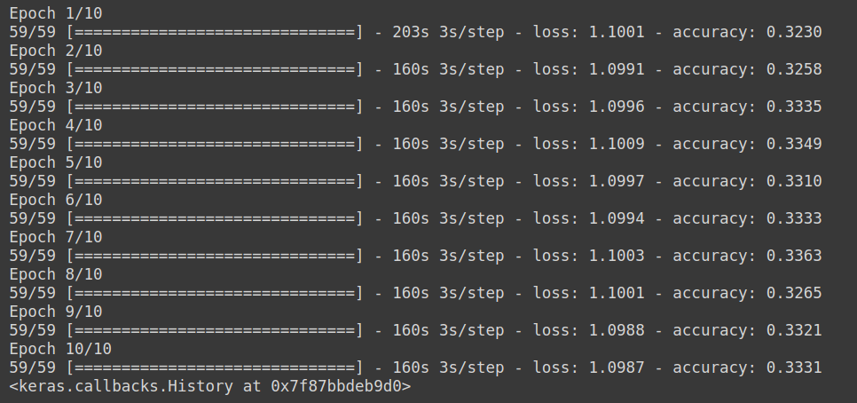
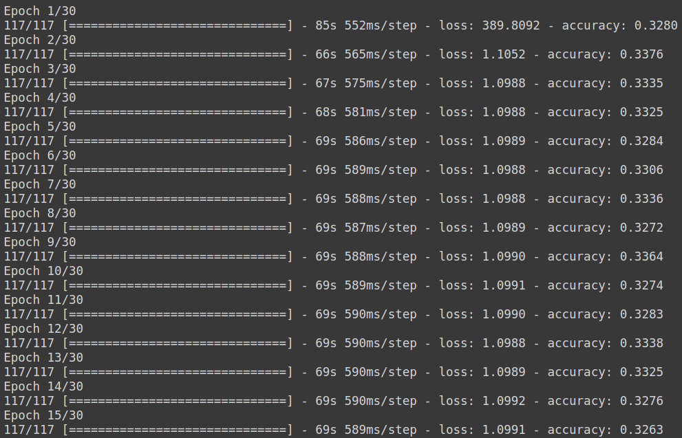
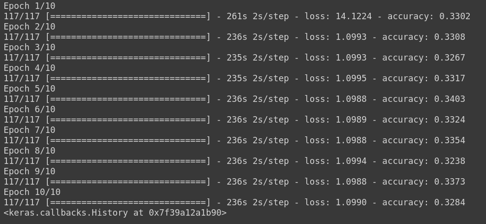

# 1D-CNN Multi-Class Model 1

>## Model Architecture :
>### This following model has been obtained from the paper authored by Yash Chauhan [1](user-content-references-:). 
``` 
Model: "sequential_1"
_________________________________________________________________
Layer (type)                 Output Shape              Param #   
=================================================================
conv1d_4 (Conv1D)            (None, 16353, 64)         2112      
_________________________________________________________________
max_pooling1d_4 (MaxPooling1 (None, 4088, 64)          0         
_________________________________________________________________
re_lu_4 (ReLU)               (None, 4088, 64)          0         
_________________________________________________________________
conv1d_5 (Conv1D)            (None, 4025, 128)         524416    
_________________________________________________________________
max_pooling1d_5 (MaxPooling1 (None, 1006, 128)         0         
_________________________________________________________________
re_lu_5 (ReLU)               (None, 1006, 128)         0         
_________________________________________________________________
conv1d_6 (Conv1D)            (None, 943, 256)          2097408   
_________________________________________________________________
max_pooling1d_6 (MaxPooling1 (None, 235, 256)          0         
_________________________________________________________________
re_lu_6 (ReLU)               (None, 235, 256)          0         
_________________________________________________________________
conv1d_7 (Conv1D)            (None, 108, 512)          16777728  
_________________________________________________________________
max_pooling1d_7 (MaxPooling1 (None, 27, 512)           0         
_________________________________________________________________
re_lu_7 (ReLU)               (None, 27, 512)           0         
_________________________________________________________________
flatten_1 (Flatten)          (None, 13824)             0         
_________________________________________________________________
dense_4 (Dense)              (None, 13824)             191116800 
_________________________________________________________________
dense_5 (Dense)              (None, 128)               1769600   
_________________________________________________________________
dense_6 (Dense)              (None, 64)                8256      
_________________________________________________________________
dropout_1 (Dropout)          (None, 64)                0         
_________________________________________________________________
dense_7 (Dense)              (None, 2)                 130       
=================================================================
Total params: 212,296,450
Trainable params: 212,296,450
Non-trainable params: 0
_________________________________________________________________
```

>## Classes :
```
    1. Noise 
    2. BBH signal + Noise
    3. BNS signal + Noise
```

>## Dataset :
```
| S.No. | Data Type          | Mode of generation   | No. of Samples |
| ----- | ------------------ | -------------------- | -------------- |
| 1     | Noise              | Gaussian             | 5000           |
| 2     | BBH signal + Noise | SEOBNRv2             | 5000           |
| 3     | BNS signal + Noise | IMRPhenomPv2_NRTidal | 5000           |
```

>## Trial Hyperparameters :
```
| Trial No. | Normalized? | Val split(in %) | Dropout rate | Optimizer | lr   | Batch Size | Epochs |
| --------- | ----------- | --------------- | ------------ | --------- | ---- | ---------- | ------ |
| 1         | No          | 0               | 0.2          | Adam      | 1e-3 | 256        | 10     |
| 2         | No          | 0               | 0.2          | Adam      | 1e-2 | 128        | 10     |
| 3         | No          | 0               | 0.2          | Adam      | 1e-2 | 128        | 15     |
| 4         | No          | 0               | 0.2          | Adam      | 1e-1 | 128        | 10     |
| 5         | No          | 0               | 0.2          | Adam      | 1e-4 | 128        | 10     |
| 6         | Yes         | 0               | 0.2          | Adam      | 1e-3 | 128        | 10     |
```

>## Trial Results :
>### Trial 1:
<p align="center">  </p>

>### Trial 2:
<p align="center">  </p>

>### Trial 3:
<p align="center">  </p>

>### Trial 4:
<p align="center">  </p>

>### Trial 5:
<p align="center">  </p>

>### Trial 6:
<p align="center">  </p>

>## Conclusions :

+ ### <p> Batch size = 128 is ideal since it has a faster runtime than batch size = 256 and it also does not cause the runtime  to crash due to exhaustion of RAM resources on colab. </p>
+ ### <p> 10 epochs are enough to determine whether the model is able to learn any features. </p>
+ ### <p> lr = 1e-4 hardly causes any change in the loss and accuracy at all so there is no point in reducing the learning rate further. </p>
+ ### <p> Normalization of the dataset caused the training time to increase significantly, and the results were still baseline, so it is not feasible to try out further combinations with normalization. </p>

>## References :
1. ### <p>Chauhan, Y., 2020. Deep Learning Techniques to Make Gravitational Wave Detections from Weak Time-series Data. arXiv preprint arXiv:2007.05889.</p>


